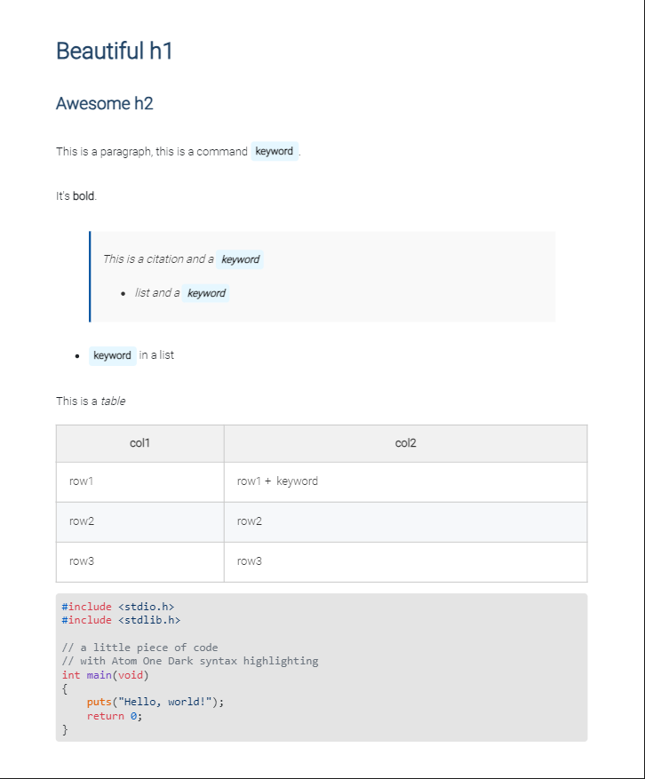

# A4-marp

[Marp](https://marp.app/) CSS theme for creating A4 presentations with a focus on clarity and printing efficiency.

This repository provides a Light theme optimized for presentations and document-like PDFs. The setup ensures compatibility with VS Code and Marp.

## Features

- A4 page layout for seamless printing and PDF generation.
- Clean Light theme with customizable styles.
- Easy setup with `.vscode/settings.json` for consistent rendering.
- Printing-friendly CSS adjustments for reduced ink usage.

## Prerequisites

Before using this repository, ensure you have:

1. [VS Code](https://code.visualstudio.com/) installed.
2. [Marp for VS Code](https://marketplace.visualstudio.com/items?itemName=marp-team.marp-vscode) extension installed.

## Setup

1. Clone this repository:
   ```bash
   git clone https://github.com/StatPan/A4-marp.git
   cd A4-marp
   ```

2. Open the folder in VS Code:
   ```bash
   code .
   ```

3. Start creating your Markdown file:
   ```markdown
   ---
   marp: true
   theme: a4-light
   paginate: true
   ---
   ```

## Quick Note Creation Script

You can automate the creation of a new project folder with this script. Add it to your `~/.bashrc` or `~/.zshrc`:

```bash
function notes() {
    mkdir "$1" && cd "$1" && mkdir .vscode
    wget -q "https://raw.githubusercontent.com/StatPan/A4-marp/main/.vscode/settings.json"
    mv settings.json .vscode
    echo "---" >> "$1".md
    echo "marp: true" >> "$1".md
    echo "theme: a4-light" >> "$1".md
    echo "paginate: true" >> "$1".md
    echo "---" >> "$1".md
    echo "" >> "$1".md
    date=$(date)
    echo "<!-- $date -->" >> "$1".md
    echo "" >> "$1".md
    echo "# $1" >> "$1".md
    wget -q "https://raw.githubusercontent.com/StatPan/A4-marp/main/a4-light.css"
    code .
}
```

> Usage: `notes <project_name>`
>
> This will create a folder `<project_name>` containing a file `<project_name>.md` with the date inside. It will also create the folder `<project_name>/.vscode` and apply the A4 Light theme.

## Light Theme Usage

Include the following at the beginning of your `.md` file to use the Light theme:

```markdown
---
marp: true
theme: a4-light
paginate: true
---
```


## Printing Efficiency

To optimize for ink-saving when printing, you can adjust the following styles in `a4-light.css`:

```css
pre {
    border-radius: .4em;
    padding: 0.2em 0.5em;
    line-height: 1.15;
    overflow-x: auto;
    padding: 0.6em;
    word-break: break-all;
    white-space: pre-wrap !important;
    font-size: 94%;
    border-style: solid;
    border-width: 1px;
}

code {
    font-family: Consolas, "Liberation Mono", Menlo, Courier, monospace;
    color: black;
    overflow-x: auto;
}
```



This ensures that your printed documents maintain clarity while conserving ink.

---

For any issues or feature requests, feel free to contribute or raise an issue in the repository.

